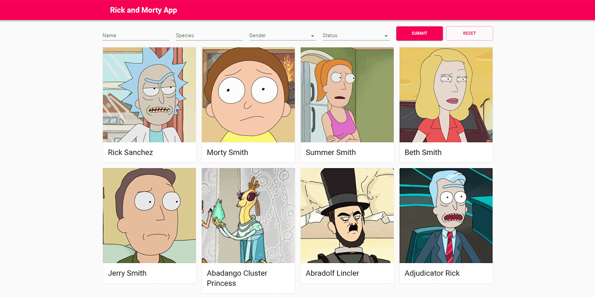

# Rick and Morty App
**A sample frontend project on React-TypeScript-Material UI**



A sample application dedicated to Rick and Morty animated TV series.

* Current live version at [https://cat-street.github.io/rick-and-morty](https://cat-street.github.io/rick-and-morty)

---

## Usage
* Install dependencies:
```
npm install
```
* Run in development mode:
```
npm start
```
* Create a production build:
```
npm run build
```

## Features

* Application fetches data from [Rick and Morty API](https://rickandmortyapi.com/)
* There are four routes: main page (characters), single character, episode and location
* The default route includes a list of all show's characters divided by pages with a filtering feature by name/species/status/gender
* The *```/character```* route includes information about an individual character and a list of appearance episodes
* The *```/episode```* route includes information about a single episode and a list of characters which appeared in it
* The *```/location```* route includes information about a single location and a list of its residents

## Technology

* React (functional components, hooks, custom hooks)
* react-router
* react-query
* TypeScript
* Formik
* JavaScript (ES6)
* Material UI
* Adaptive layout
* Airbnb-typescript ESLint codestyle

## Possible improvements
* Automated testing
